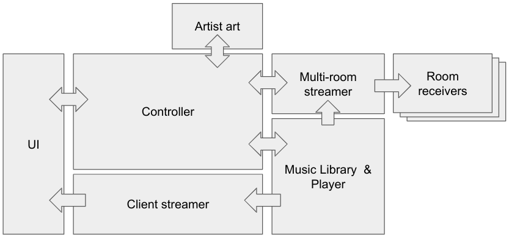

# BoelMuziek

One music collection, playing everywhere.

A music player that offers diverse navigation options through your music library and allows you to make choices about when to indulge in your favorite tunes. Whether you prefer the intimate experience on the device you're using for navigation or desire to immerse your space in a harmonious ambiance, the player seamlessly extends its capabilities to play music across multiple devices on the local network.

## Components

### Functional


### Technical


## Set-up

The total stack can be deployed by using [Docker Compose](https://docs.docker.com/compose/install/) and the docker-compose.yml file found in the repo's root directory. Before firing up the docker compose you need to:

* Create stack specific directories that need to be made up front which should be readable and writable by all containers, you can use/adjust and execute the file ```init.sh``` to create them.
* change the ```DIR_``` variables in the ```.env``` file to reflect your system. The ```DIR_MUSIC``` variable should point to your music collection.

After firing up docker compose, you have a stack which consists of the following components:

* [MPD](https://musicpd.org/) is a server side music player which also allows querying it's music library.
* [ympd](https://ympd.org/) is a temporary MPD web client, included here to quickly review the stack's functionality. Once the stack is deployed you can find it at http://localhost:8080
* [Icecast](https://icecast.org/) is used to stream music to the client. You can listen to the playback stream at http://localhost:8000/mpd
* [Snapcast server](https://github.com/badaix/snapcast) is used to stream the music over the LAN to be received by all subscribed clients using Snapcast's client. Access the volume of all clients at http://localhost:1780/.
* Controller - Start of a self built [FastAPI](https://fastapi.tiangolo.com/) interface to MPD. Visiting http://localhost:5000/ tells you the playback status of the MPD server.

How each components is created can be found within it's own subdirectory:

```bash
.
├── controller  'Developing playback commands, states and library querying'
├── icecast     'Stream music to client'
├── mpd         'The music library player'
├── snapserver  'Snapcast server that serves audio for multi-room purposes'
├── ui          'Developing UI'
└── ympd        'Contains a temporary UI that will de replaced by the developing ui'
```
